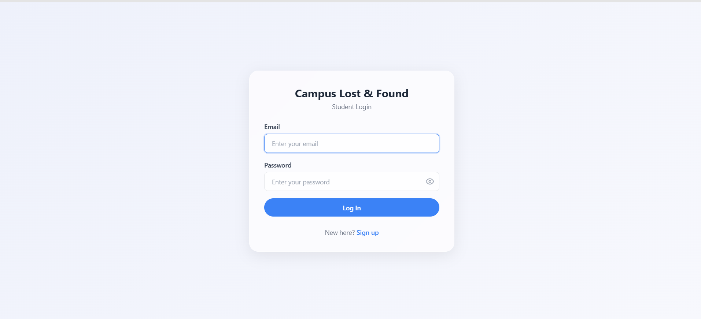
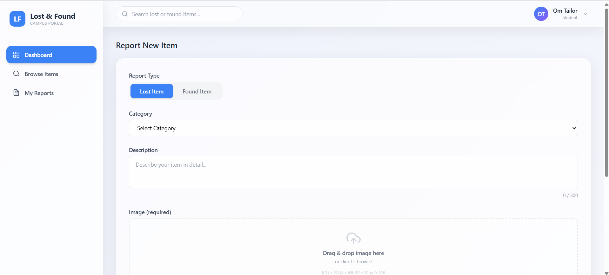
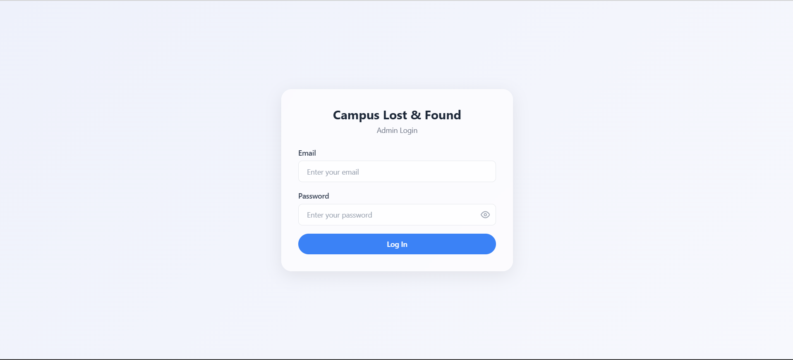
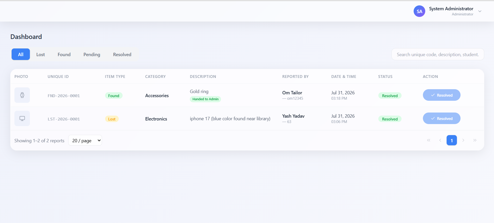

# 🔍 Lost & Found Management System

A full-stack web application that helps students and administrators manage lost and found items on campus. Users can report lost or found items, browse listings, and track resolution status — all through a clean and responsive interface.

## ✨ Features

- **👤 Student Portal** — Register, log in, report lost or found items, and track your reports.
- **🛡️ Admin Panel** — Review reported items, approve or resolve listings, and manage the system.
- **🖼️ Image Upload** — Attach photos to item reports with a streamlined image pipeline.
- **🔐 JWT Authentication** — Secure login with password hashing (bcrypt).
- **📱 Responsive UI** — Modern interface built with React, Vite, and Tailwind CSS.

## 🛠️ Tech Stack

| Layer    | Technology                                        |
| -------- | ------------------------------------------------- |
| Frontend | React 19, Vite 8, Tailwind CSS 4, React Router 7  |
| Backend  | Node.js, Express 5                                |
| Database | MySQL (mysql2)                                    |
| Auth     | JWT, bcrypt                                       |

## 📸 Screenshots

### Student Portal

| Student Login | Student Dashboard |
| ------------- | ----------------- |
|  |  |

### Admin Panel

| Admin Login | Admin Dashboard |
| ----------- | --------------- |
|  |  |

## 🚀 Getting Started

### Prerequisites

- Node.js (v18 or later)
- MySQL server

### 1. Backend

```bash
cd backend
npm install
cp .env.example .env   # configure database credentials
npm start
```

### 2. Frontend

```bash
cd frontend
npm install
npm run dev
```

Open [http://localhost:5173](http://localhost:5173) in your browser.

## 📁 Project Structure

```
lost_found/
├── backend/     # Express API, auth, routes, migrations, uploads
├── frontend/    # React SPA (Vite + Tailwind CSS)
└── assets/      # Screenshots and shared resources
```
